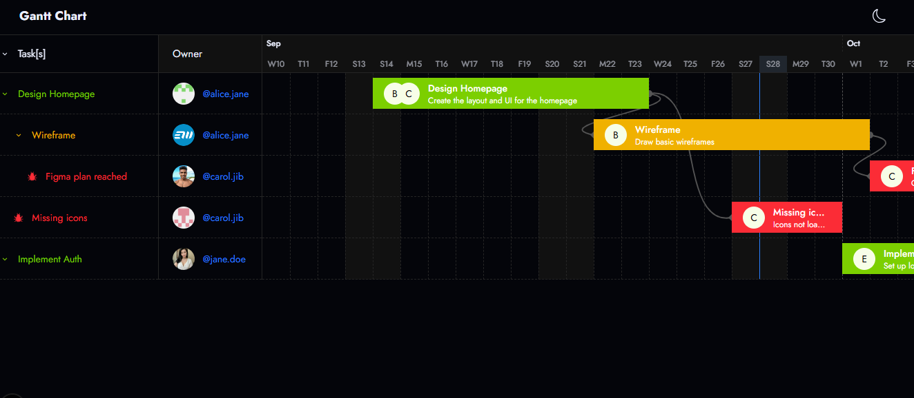

# 📊 Gantt Chart App (Next.js + TypeScript)

A fully interactive Gantt chart built with **Next.js**, **TypeScript**, and **TailwindCSS** — featuring drag-and-drop task scheduling, timeline scaling, and dynamic dependency lines using SVG.

---

## 🚀 Features

- 🧱 **Custom Gantt Chart from Scratch**
  - No external Gantt libraries — built using raw DOM events and `useRef`
  - Draggable tasks, subtasks, and issues

- 🧩 **Task Dependencies**
  - Connect tasks visually using SVG lines
  - Lines auto-update when tasks are moved

- 🌓 **Responsive UI with TailwindCSS**
  - Scrollable timeline
  - Responsive layout with dark mode support

- 🧠 **State Management**
  - `useContext` + `useReducer` for scalable global state
  - Re-renders optimized per component scope

- 💾 **Mock Data + Persistence Ready**
  - Uses dummy tasks/subtasks/issues for demo
  - Easily pluggable with real APIs or databases

---

## 🖼️ Demo Screenshot

 

---

## 📦 Tech Stack

- **Framework:** Next.js 13+ (App Router)
- **Language:** TypeScript
- **Styling:** TailwindCSS
- **State:** useContext + useReducer
- **SVG Logic:** Native DOM / `useRef` for drag handling

---

## 🧪 Getting Started

1. **Clone the repo**
```bash
git clone https://github.com/whispnode/gantt-chart.git
cd gantt-chart
